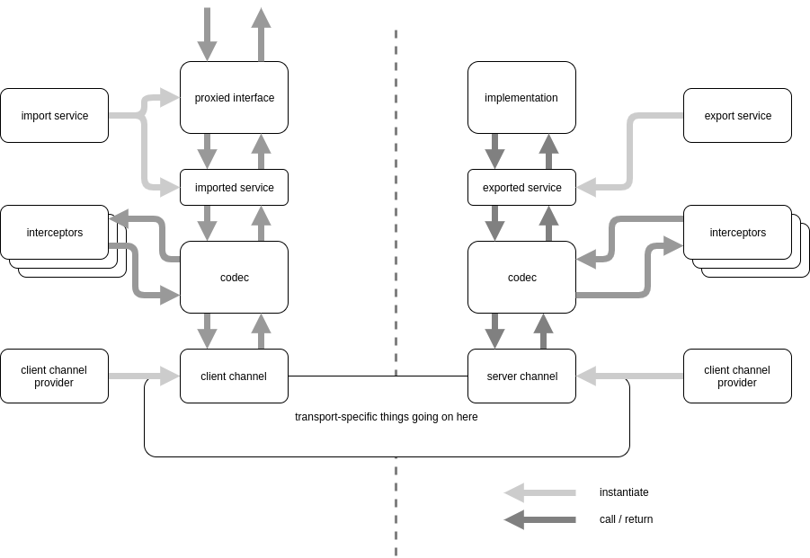

# Simple Remoting

this is a small library that performs a bit of spring magic to create proxies for interfaces, and makes them available for autowiring, then forwards these to a remote implementation. for transport, the only option currently available is rabbitMQ.

### Overview

when this library is invoked, it will do two things when the application is starting: it will look for beans that are annotated to be exported (i.e. made available for remote calls), and it will look for interfaces that are annotated to be imported (i.e. have proxies created). the components that do this are called `RemotingExportService` and `RemotingImportService`.

These will be looking for concrete classes with `@RemotingEndpoint` (for export) and interfaces with  `@RemoteEndpoint` (for import). If an interface marked as `@RemoteEndpoint` already has an implementation available in the local context, it is skipped. Otherwise, for each of these interfaces a bean of scope prototype is created. This can then will use an instance of `RemotingCodec` and `ClientChannel` (acquired from a `ClientChannelProvider`) to map the method invocation to a `RemotingRequest` and send it out. On the other side, a `ServerChannel` (from a `ServerChannelProvider`) passes the request up through another `RemotingCodec` to an `ExportedService`.  

The details of message routing are up to the `ClientChannel` / `ServerChannel` implementation.




### Annotations

##### RemotingEndpoint and RemoteEndpoint

The two key annotations are RemotingEndpoint and RemoteEndpoint. These annotations control which interfaces are available for remoting.

@RemotingEndpoint marks an implementation bean as "exportable". It has to sepcify the corresponding interface, and that interface also has to be marked as @RemoteEndpoint. 

@RemoteEndpoint marks an interface as "importable". It has to specify an "app name" and a "service name", which can be used for routing messages. 

A simple remotable service looks like this:

**Interface RandomService**

```java
package com.mcg.tools.remoting.ex.server.api.services;

import com.mcg.tools.remoting.api.annotations.RemoteEndpoint;

@RemoteEndpoint(app="foo", name="bar")
public interface RandomService {

	public int getNumber();

	public void printSomething(String s);
	
}
```

**Implementation RandomServiceImpl**

```java
package com.mcg.tools.remoting.ex.server.impl.app;

import org.springframework.stereotype.Service;

import com.mcg.tools.remoting.api.annotations.RemotingEndpoint;
import com.mcg.tools.remoting.ex.server.api.services.RandomService;

@Service
@RemotingEndpoint(value=RandomService.class)
public class RandomServiceImpl implements RandomService {

	@Override
	public int getNumber() {
		return (int)(Math.random()*100d);
	}

	@Override
	public void printSomething(String s) {
		System.err.print(s);
	}

}
```

##### RemotingTimeout

This annotation can be placed on the method declaration on the interface, overriding the global timeout. Note that the default timeout is 10s, which can be overridden globally (see below for config options).

### Codec

The codec is responsible for serializing requests and responses from and to byte arrays suitable for sending over the wire. This is also used for mapping arguments to the actual method. 

There are two ways to interfere with the object mapping in the codec. 

**Provide an ObjectMapper**

The default codec implementation has an instance of `ObjectMapper` autowired. If this is not set, it will create a default object mapper.

**Override the Codec**

You can also change the codec behaviour by either extending it and overriding the `conform` method, or by implementing your own codec altogether. The basic contract is that a codec has to call all interceptors, and be able to convert from and to byte arrays. The exact way you end up doing this is up to you.

---

```
note that if your interface takes interfaces as arguments OR returns interfaces as return values, you may have to add mappings to concrete classes for these.
```

---

### Interceptors

Interceptors can be used to add side-channel information. In most cases, this will be useful for adding and reading authentication information, so that the call on the remote environment is executed within the same authentication context. 

I frequently use this to pass along a JWT token with the remoting request, where I store the authentication token received from a client for example via HTTP in my security context, then, when perform remoting calls, I add this token as a header in the remoting request, and read it on the other side just like I would read an authentication header on an HTTP request.

### Config Options

Here's a list of configuration options:

```
mcg.remoting:
	timeout: 10   [timeout, in seconds]
	poolsize: 8   [size of executor threadpool]
```

